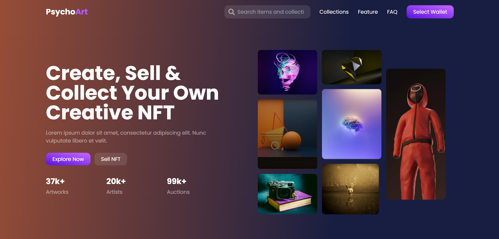

<p align="center">
  <a href="https://github.com/joonacode/psychoart_landing_page">
    
  </a>

  <h1 align="center">PsychoArt</h3>
Mencoba tailwindcss v3.0 dengan mengslicing landing page. Design by <a href='https://www.figma.com/@zet_dev'>Dliya' Zarror Nibros</a>
<br/ >
  <p align="center">
    <br />
    <a href="https://psychoart.joonacode.com">View Demo</a>
  </p>
</p>

### Built With

* [Next JS](https://nextjs.org/)
* [Tailwindcss](https://tailwindcss.com/)

<!-- GETTING STARTED -->
## Getting Started

### Setup .env example

Create .env file in your root project folder.

```
NEXT_PUBLIC_MAIN_URL=http://localhost:3000/
```

### Installation

1. Clone the repo
```sh
git clone https://github.com/joonacode/psychoart_landing_page.git
```
2. Install NPM packages
```sh
npm install or yarn install
```
3. Run project
```sh
npm run dev or yarn dev
```

<!-- CONTRIBUTING -->
## Contributing

Contributions are what make the open source community such an amazing place to be learn, inspire, and create. Any contributions you make are **greatly appreciated**.

1. Fork the Project
2. Create your Feature Branch (`git checkout -b feature/AmazingFeature`)
3. Commit your Changes (`git commit -m 'Add some AmazingFeature'`)
4. Push to the Branch (`git push origin feature/AmazingFeature`)
5. Open a Pull Request


<!-- CONTACT -->
## Contact

joonacode@gmail.com

Project Link: [https://github.com/joonacode/psychoart_landing_page.git](https://github.com/joonacode/psychoart_landing_page.git)


<!-- ACKNOWLEDGEMENTS -->
## Acknowledgements
* [react-awesome-reveal](https://www.npmjs.com/package/react-awesome-reveal)
* [@emotion/react](https://www.npmjs.com/package/@emotion/react)
